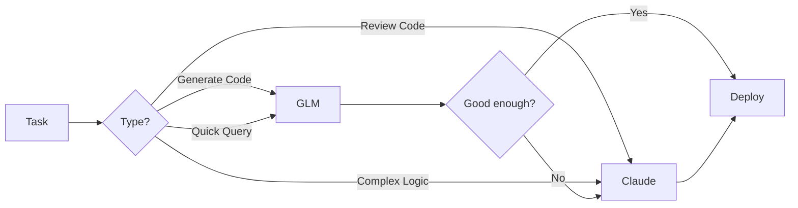

# AI Integration for OAGB Website Development

## 📖 Overview

This repository now supports **dual AI development** with both GLM 4.5 (Zhipu AI) and Claude, giving you the best of both worlds for building the OAGB website.

## 🎯 Why Two AI Models?

### GLM 4.5 (Zhipu AI)
- 🇨🇳 **Better for**: Chinese/Portuguese content, cost-effective bulk operations
- 💰 **Cost**: More affordable for high-volume usage
- ⚡ **Speed**: Fast responses with glm-4-flash model
- 🎨 **Use Cases**: Code generation, SQL queries, translations

### Claude (Anthropic)
- 🇺🇸 **Better for**: Complex reasoning, code review, architecture
- 🔒 **Security**: Excellent for security analysis
- 📚 **Documentation**: Superior for technical writing
- 🎨 **Use Cases**: Debugging, refactoring, system design

## 📁 Documentation Structure

```
c:\xampp\htdocs\oagb\
├── README_AI.md ..................... (This file) Overview
├── QUICK_START.md ................... Fast 5-minute setup guide
├── AI_DEVELOPMENT_GUIDE.md .......... Complete integration guide
├── test_glm_connection.py ........... Test GLM connection
└── examples/
    ├── glm_code_generator.py ........ Interactive code generator
    └── ai_comparison.py ............. Compare GLM vs Claude
```

## 🚀 Quick Start

### Option 1: Just Want to Try It? (2 minutes)

```bash
# 1. Install GLM SDK
pip install zhipuai

# 2. Get API key from https://open.bigmodel.cn/

# 3. Test it
python test_glm_connection.py
```

✅ **Read**: [QUICK_START.md](QUICK_START.md) for detailed steps

### Option 2: Full Integration (10 minutes)

1. Complete Quick Start above
2. Read [AI_DEVELOPMENT_GUIDE.md](AI_DEVELOPMENT_GUIDE.md)
3. Try example scripts in `examples/`
4. Start using both AIs in your workflow

## 🔄 Typical Workflow



### Example: Adding New Feature

1. **Plan** (Claude via VSCode)
   - Ask: "Help me design a lawyer certification tracking feature"

2. **Generate** (GLM via Python)
   - Ask: "Generate PHP class for certification management"

3. **Review** (Claude via VSCode)
   - Ask: "Review this code for security and best practices"

4. **Refine** (GLM if needed)
   - Ask: "Optimize this specific function"

5. **Deploy** (Both for testing)
   - GLM: Generate test cases
   - Claude: Review test coverage

## 💻 Usage Examples

### In VSCode (Claude - Current Setup)
```
You: "Review includes/functions.php for security issues"

Claude: [Provides detailed security analysis]
```

### In Terminal (GLM - New Capability)
```python
from zhipuai import ZhipuAI
client = ZhipuAI(api_key="your-key")

response = client.chat.completions.create(
    model="glm-4-plus",
    messages=[{
        "role": "user",
        "content": "Generate PHP function to validate Guinea-Bissau phone numbers"
    }]
)

print(response.choices[0].message.content)
```

### Using Helper Class (Recommended)
```php
<?php
require_once 'includes/ai_helper.php';

$ai = new AIHelper('glm');

// Generate Portuguese content
$article = $ai->generatePortugueseContent(
    'Nova regulamentação para advogados',
    'article'
);

// Switch to Claude for review
$ai->setProvider('anthropic');
$review = $ai->generateCode('Review this article for professionalism');
```

## 📊 Decision Matrix

| Task | Use GLM | Use Claude | Why |
|------|---------|------------|-----|
| Generate CRUD operations | ✅ | | Faster, cheaper |
| Security audit | | ✅ | Better analysis |
| SQL query generation | ✅ | | Specialized for this |
| Architecture design | | ✅ | Complex reasoning |
| Portuguese content | ✅ | | Better localization |
| Code refactoring | | ✅ | Quality focus |
| Form validation code | ✅ | | Quick generation |
| Debugging complex issues | | ✅ | Better reasoning |
| Bulk operations | ✅ | | Cost effective |
| Final review | | ✅ | Quality assurance |

## 🛠️ Available Tools

### 1. Connection Tester
```bash
python test_glm_connection.py
```
- Tests GLM API connection
- Saves configuration
- Updates .gitignore

### 2. Code Generator (Interactive)
```bash
python examples/glm_code_generator.py
```
Menu options:
- Generate PHP functions
- Generate SQL queries
- Create form validation
- Build API endpoints
- Optimize existing code
- Explain code

### 3. AI Comparison Tool
```bash
python examples/ai_comparison.py
```
- Compare responses side-by-side
- Measure speed and quality
- Save comparisons
- Test different prompts

## 📚 Real-World Examples

### Example 1: Lawyer Search Feature

**With GLM:**
```python
# Generate search function
client.chat.completions.create(
    model="glm-4-plus",
    messages=[{
        "role": "user",
        "content": """
        Generate PHP function to search lawyers with filters:
        - Name (partial match)
        - Region (dropdown)
        - Specialization (multi-select)
        - Status (active/inactive)

        Use PDO, prevent SQL injection, return array
        """
    }]
)
```

**Review with Claude (VSCode):**
```
"Review this generated search function for:
- SQL injection vulnerabilities
- Performance optimization
- Input validation
- Error handling"
```

### Example 2: News Article Management

**Content in Portuguese (GLM):**
```python
"Escreva um artigo de 300 palavras sobre:
'A importância da ética profissional na advocacia'
Para publicar no site da Ordem dos Advogados"
```

**Review (Claude):**
```
"Check this Portuguese article for:
- Professional tone
- Grammar correctness
- Appropriate length
- SEO optimization"
```

### Example 3: Database Optimization

**Query Analysis (GLM):**
```python
"Optimize this query and explain improvements:
SELECT a.*, COUNT(c.id) as total_cases
FROM advogados a
LEFT JOIN casos c ON a.id = c.advogado_id
WHERE a.status = 'ativo'
GROUP BY a.id"
```

**Security Review (Claude):**
```
"Is this optimized query:
- Secure against SQL injection?
- Properly indexed?
- Following best practices?"
```

## 🔐 Security Checklist

- [ ] API keys stored in `ai_config.php`
- [ ] `ai_config.php` added to `.gitignore`
- [ ] Never commit keys to repository
- [ ] Use environment variables for production
- [ ] Rotate keys every 3-6 months
- [ ] Different keys for dev/prod environments
- [ ] Review all AI-generated code before use
- [ ] Validate and sanitize all inputs
- [ ] Test generated code thoroughly

## 💰 Cost Optimization

### Best Practices
1. **Use appropriate model for task**
   - Simple: glm-4-flash
   - Medium: glm-4-air
   - Complex: glm-4-plus

2. **Cache common responses**
   - Store frequently used queries
   - Reuse generated code snippets

3. **Batch similar requests**
   - Combine related questions
   - Process in single call

4. **Monitor usage**
   - Track tokens per request
   - Set monthly budgets
   - Review spending reports

### Cost Comparison (Approximate)
| Task | GLM 4.5 | Claude | Savings |
|------|---------|--------|---------|
| Simple query | $0.001 | $0.003 | 67% |
| Code generation | $0.005 | $0.015 | 67% |
| Long document | $0.020 | $0.060 | 67% |

## 🎓 Learning Path

### Week 1: Setup & Basics
- [ ] Complete Quick Start
- [ ] Test GLM connection
- [ ] Try example scripts
- [ ] Generate simple PHP function
- [ ] Compare GLM vs Claude

### Week 2: Integration
- [ ] Create `ai_helper.php`
- [ ] Use AI in one feature
- [ ] Review generated code
- [ ] Implement hybrid workflow
- [ ] Document your process

### Week 3: Optimization
- [ ] Optimize prompt engineering
- [ ] Implement caching
- [ ] Track costs
- [ ] Refine workflows
- [ ] Share learnings

### Week 4: Advanced
- [ ] Build custom tools
- [ ] Automate repetitive tasks
- [ ] Create project templates
- [ ] Optimize for speed/cost
- [ ] Train team members

## 📖 Additional Resources

### Documentation
- [QUICK_START.md](QUICK_START.md) - Fast setup guide
- [AI_DEVELOPMENT_GUIDE.md](AI_DEVELOPMENT_GUIDE.md) - Complete guide
- [CLAUDE.md](CLAUDE.md) - Project context for Claude

### External Links
- [GLM API Docs](https://open.bigmodel.cn/dev/api)
- [Claude API Docs](https://docs.anthropic.com/)
- [GLM Playground](https://open.bigmodel.cn/console/playground)
- [Claude Workbench](https://console.anthropic.com/workbench)

### Example Code
- `test_glm_connection.py` - Connection tester
- `examples/glm_code_generator.py` - Code generator
- `examples/ai_comparison.py` - AI comparison tool

## 🆘 Support

### Getting Help

1. **Check Documentation**
   - Start with QUICK_START.md
   - Read AI_DEVELOPMENT_GUIDE.md
   - Review examples

2. **Test Scripts**
   - Run `test_glm_connection.py`
   - Try example scripts
   - Check error messages

3. **Ask Claude**
   - Use VSCode extension
   - "Help me troubleshoot GLM setup"
   - Paste error messages

4. **Community**
   - GLM Forum
   - Stack Overflow
   - GitHub Issues

### Common Issues

**Issue**: GLM not installed
```bash
pip install zhipuai
```

**Issue**: API key not working
1. Check format (xxxxx.xxxx...)
2. Verify in dashboard
3. Generate new key

**Issue**: Connection timeout
1. Check internet
2. Try again later
3. Verify firewall

**Issue**: Import errors
```bash
python -m pip install --upgrade zhipuai
```

## 🎉 You're Ready!

You now have:
- ✅ Two powerful AI models at your disposal
- ✅ Clear guidelines on when to use each
- ✅ Example scripts and tools
- ✅ Security best practices
- ✅ Cost optimization strategies

**Start simple, experiment, and scale up!**

---

**Next Steps:**
1. Read [QUICK_START.md](QUICK_START.md) (5 minutes)
2. Test GLM connection
3. Try one example
4. Start using in your development

**Questions?** Check the guides or ask Claude in VSCode!
