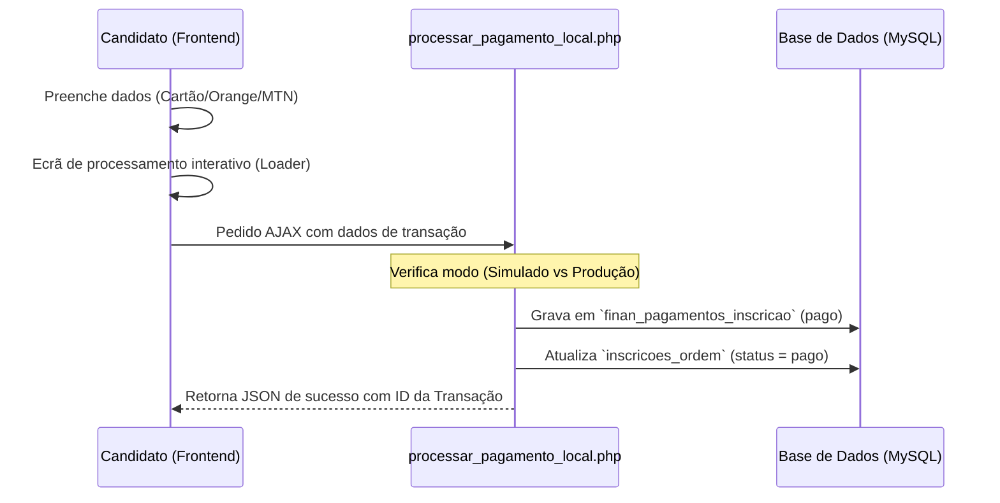
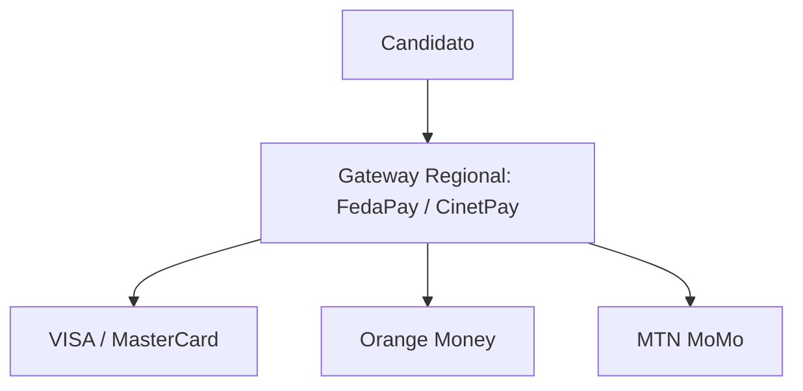

# Guia de Transição: Pagamento Simulado para Pagamento Real (OAGB)

Este guia descreve os passos técnicos, a arquitetura de código e as recomendações para transitar do **modo de simulação interativo** (atual) para o processamento de **transações reais** nas inscrições da Ordem dos Advogados da Guiné-Bissau.

---

## 1. Arquitetura Atual (Segurança & Transição)

O portal está atualmente equipado com uma arquitetura de pagamento em duas camadas que simula o fluxo completo no frontend para o utilizador, mas realiza a **persistência auditável na base de dados**.



> [!NOTE]
> Esta arquitetura garante que mesmo em modo simulado, todos os pagamentos e referências de transação são registados de forma segura na base de dados, permitindo aos administradores validar as entradas na tesouraria de forma manual ou automática.

---

## 2. Como Alternar entre Simulado e Real (Via Admin)

Nas **Configurações de Tesouraria** (`/admin/modules/financeiro/configuracoes.php`), já existem os campos preparados para a transição:

| Configuração | Descrição | Comportamento |
|---|---|---|
| **Gateway Orange Money** | `orange_money_enabled` | **0**: Modo Simulação (local)<br>**1**: Modo Real (API Orange) |
| **Gateway MTN MoMo** | `mtn_momo_enabled` | **0**: Modo Simulação (local)<br>**1**: Modo Real (API MTN) |

Para ativar o modo real, o administrador deve:
1. Ir a **Admin → Financeiro → Configurações**.
2. Alterar a configuração para **ATIVADO**.
3. Inserir os respetivos parâmetros oficiais de produção fornecidos pelos operadores nos campos correspondentes.

---

## 3. Roteiro de Integração das APIs Reais

Para tornar as transações reais na Guiné-Bissau, a OAGB tem duas rotas de implementação:

### Opção A: Integração Direta com os Operadores (Orange e MTN)
Requer a assinatura de contratos comerciais com as sedes da **Orange Bissau** e da **MTN Guiné-Bissau** para obter as chaves de API e Merchant IDs.

#### 1. Orange Money API
* **Documentação Oficial**: Orange Developer Portal (Orange Money Web Payment).
* **Fluxo de API**:
  1. O servidor OAGB efetua um pedido `POST` para `https://api.orange.com/orange-money-webpay/gw/v1/webpayment` com o valor, moeda (`XOF`) e referência.
  2. A API Orange devolve um `payment_url` e um `token`.
  3. O candidato é redirecionado para o portal seguro da Orange para autorizar o pagamento via telemóvel, retornando depois ao portal da OAGB.
* **Webhook**: A Orange envia uma notificação instantânea (IPN) para o nosso script confirmando o sucesso.

#### 2. MTN MoMo API
* **Documentação Oficial**: MTN MoMo Developer Portal (Collections API).
* **Fluxo de API**:
  1. O servidor OAGB inicia um pedido *Request to Pay* enviando um `POST` para `/collection/v1_0/requesttopay` contendo o número de telemóvel do cliente (`+24596...`) e o valor.
  2. O telemóvel do candidato recebe instantaneamente um ecrã *Push USSD* a solicitar o PIN.
  3. O servidor da OAGB monitoriza o estado enviando pedidos `GET` para `/collection/v1_0/requesttopay/{referenceId}` até obter o estado `SUCCESSFUL`.

---

### Opção B: Integração com Gateways Multicanal Regionais (Recomendada)
Em vez de integrar cada operador individualmente (e lidar com a ausência do Stripe na Guiné-Bissau), pode utilizar-se um gateway regional que suporte a zona **UEMOA** (União Económica e Monetária do Oeste Africano) e a moeda **XOF**.

Estes gateways unificam **Cartões de Crédito (VISA/Mastercard)**, **Orange Money** e **MTN MoMo** numa única API:

1. **FedaPay** (`fedapay.com`): Suporta pagamentos com cartões internacionais e carteiras móveis na zona UEMOA em XOF.
2. **CinetPay** (`cinetpay.com`): Amplamente utilizado na África Ocidental, permite processar pagamentos de cartões e mobile money locais.



---

## 4. Atualização de Código para Modo Real

Quando obtiver as chaves das APIs reais, o ficheiro `/processar_pagamento_local.php` deve ser modificado para validar a variável de configuração e efetuar os disparos HTTP reais.

Exemplo de estrutura condicional em PHP:

```php
// processar_pagamento_local.php

// 1. Verificar se o modo real está ativado nas configs da BD
$orange_real = ($configs['orange_money_enabled'] ?? '0') === '1';
$mtn_real    = ($configs['mtn_momo_enabled']    ?? '0') === '1';

if ($metodo === 'orange_money' && $orange_real) {
    // ──────── PROCESSO REAL ORANGE MONEY ────────
    $api_key = $configs['orange_api_key'] ?? '';
    
    // Disparar chamada cURL para a API oficial da Orange Bissau
    $response = disparar_api_orange($api_key, $telefone, $valor);
    
    if ($response['status'] === 'SUCCESS') {
        // Gravar pagamento real na BD e retornar sucesso
        registar_pagamento_sucesso($pdo, $inscricao_id, $response['txn_id'], 'orange_money', $valor);
    } else {
        json_err("Transação rejeitada pela Orange: " . $response['error_msg']);
    }
    
} else if ($metodo === 'mtn_momo' && $mtn_real) {
    // ──────── PROCESSO REAL MTN MOMO ────────
    // Chamada cURL para a API oficial da MTN MoMo Guiné-Bissau
    $response = disparar_api_mtn($configs['mtn_api_key'], $telefone, $valor);
    
    if ($response['status'] === 'SUCCESS') {
        registar_pagamento_sucesso($pdo, $inscricao_id, $response['txn_id'], 'mtn_momo', $valor);
    } else {
        json_err("Transação rejeitada pela MTN.");
    }
    
} else {
    // ──────── MODO DE SIMULAÇÃO (COMPORTAMENTO ATUAL) ────────
    processar_fluxo_simulado($pdo, $inscricao_id, $metodo, $telefone, $valor);
}
```

---

## 5. Próximos Passos Comerciais para a OAGB

Para avançar para o ambiente real, a administração da Ordem deve:

1. **Constituir Conta de Comerciante**: Entrar em contacto com os departamentos comerciais da Orange Bissau, MTN Bissau ou registar-se na plataforma FedaPay/CinetPay.
2. **Obter Credenciais de Produção**:
   - `API Key` (Chave de API)
   - `Secret Key` (Chave Privada)
   - `Merchant ID` / `Service ID`
3. **Configurar os Webhooks**: Configurar o URL de retorno no portal do gateway apontando para a OAGB para atualização automática de status de inscrições em background.
